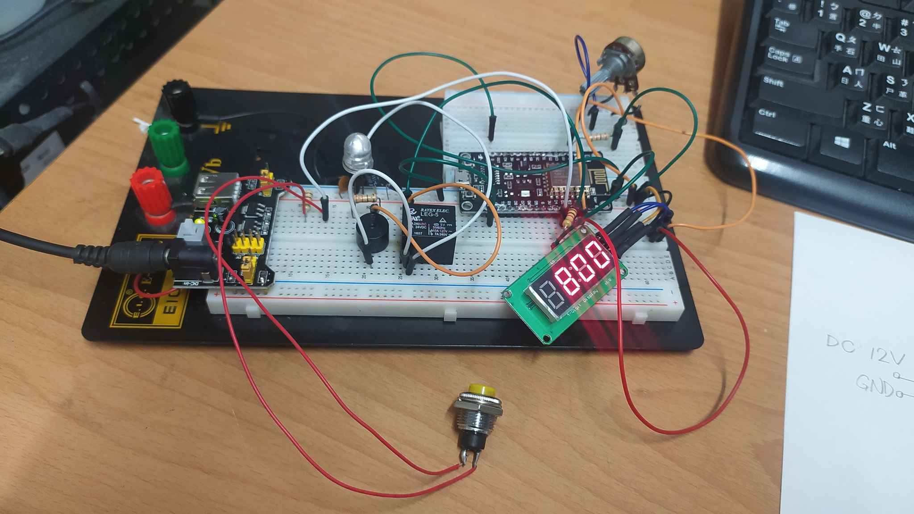

# mywelding_timer
<h2>功能：</h2>
　　微波爐變壓器改裝可調時間點焊機
 
 
作者：羽山秋人 (https://3wa.tw) 
 
最初開發日期：2021-03-27 12:05 
最後更新日期：2021-04-02 21:53 
版本：V0.1 
License：MIT 
 

 
~~~自製點焊機成功~~~

 
可調時間點焊機
<h2>說明：</h2>
　　羽山在 Youtube 上看到好多老外都用「微波爐變壓器」把細的線圈拆掉後，換上粗電線，繞個二圈，就可以作成 AC 110V to AC 1~2V 點焊機，拿來焊 18650 或其他鋰電池、鋰鐵電池、不銹鋼杯手柄，相當好用。 
　　前些日子買了一台中古的變壓器，試作成功，接下來要再作一個簡單的電路來精準控制焊接的時間，讓鎳片跟電池的焊接時間最佳化。 
　　此電路會偵測可變電阻的電阻值，將 10KΩ 轉成 50ms~1000ms，顯示在四位元七段顯示器上，此時按下「微動開關」就可以讓「繼電器Relay」打開讓交流電通過一段時間後再關上。 
　　搭配微波爐變壓器作成點焊機，即可控制點焊的時間，將來要焊電池、焊鎳片相當方便。
 
<h2>所需材料：</h2>
<ul>
  <li>微波爐變壓 800w x 1</li>
  <li>35平方軟銅線4尺</li>
  <li>鎳片/焊片各種規格</li>
  <li>粗銅線1.6mm x 7cm x 2，拆粗的單芯電線即可</li>
  <li>AC 110V TO DC 12V 變壓器(Nodemcu 供電用)</li>
  <li>YuRobot 545043 Buck x 1，或 LM2596 Buck x1 ，比較推薦用 LM2596</li>
  <li>20A 搖頭開關 x 1</li>  
  <li>Arduino ESP8266 x 1</li>
  <li>TM1637 4 Digital Display 四位元七段顯示器 x 1</li>
  <li>可變電阻 10KΩ x 1</li>
  <li>電阻 1KΩ 1/2w x 3</li>
  <li>電阻 330Ω 1/2w x 2</li>
  <li>電容 10㎌ 50V x 2</li>
  <li>LED 綠、紅 各一顆</li>
  <li>蜂嗚器 5V x 1</li>
  <li>Relay 5V x 1</li>
  <li>洞洞板 x 1</li>
  <li>微動開關 x 1</li>
  <li>二極體 1N4007 x 1</li>
</ul>
<h2>接腳說明：</h2>
<ul>
  <li>D0：TM1637 CLK</li>
  <li>D1：TM1637 DIO</li>
  <li>D2：RELAY 5V</li>
  <li>D3：微動開關 Input</li>
  <li>建議腳位可以設開一點，如 D0 D2 D4 D6，以免焊接時太近短路沒發現</li>
</ul>
<h2>使用注意事項：</h2>
<ul>
  <li>1. 燒錄程式前，請先將 3.3V 接 5V 的線拔除，或把 Nodemcu 燒好再接上此電路 (拔除後，電腦才能識別)</li>
  <li>2. (開機保護) 開機時，需按著「微動開關」再同時過電，才能正常開機 (D3 保持高電位才能正常開機 )</li>
  <li>3. (去彈跳功能)「微控開關」需壓 0.3 秒左右，才能焊接，放開後也要等 0.3 秒後再壓，才能焊下一個點</li>
</ul>
<h2>說明影片：</h2>
<ul>
  <li>影片一：<a target="_blank" href="https://youtu.be/TA6dgjnLMRM">https://youtu.be/TA6dgjnLMRM</a></li>
  <li>影片二（製作完成）：<a target="_blank" href="https://youtu.be/AywPSv3ZF3s">https://youtu.be/AywPSv3ZF3s</a></li>
</ul>
<h2>電路圖：</h2>

  

<h2>手繪電路圖：</h2>

  

<h2>麵包板測試：</h2>

  

 

